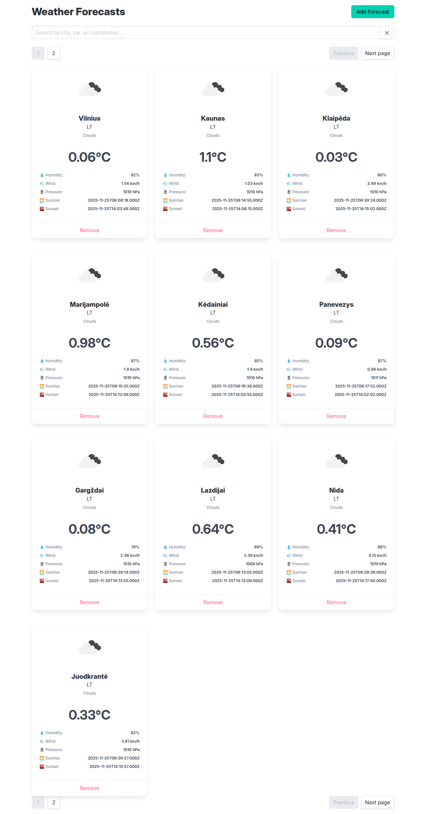
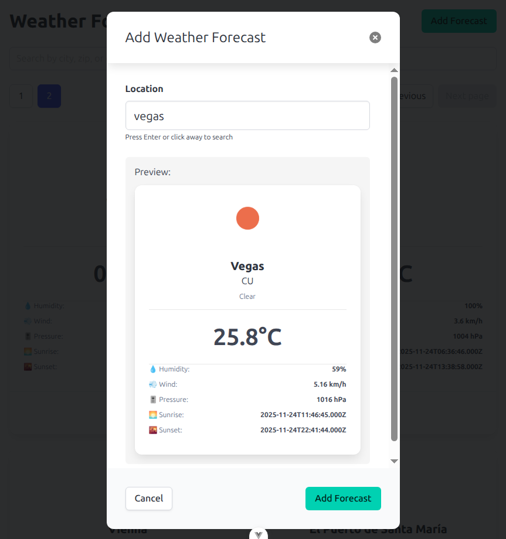

# weather-vue

[Vue](https://github.com/nojux-official/weather-vue/tree/main) | [Typescript](https://github.com/nojux-official/weather-vue/tree/typescript)

This application provides current weather information for a specified city using the OpenWeatherMap API. It is built with React, Vite and Bulma.
For the API requests, a simple Express.js proxy server is used to securely handle the OpenWeatherMap API key.

## Features
 * React frontend
 * Caching of API responses to reduce redundant requests
 * Can search by city name, geographic coordinates, or zip code
 * Error handling for invalid city names or network issues
 * Can be compiled to static files for production use

## Setup

### Prerequisites
- Node.js and npm installed (long-term support version recommended)
- OpenWeatherMap API key (get one free at [OpenWeatherMap](https://openweathermap.org/api))

### Environment Configuration
Create a `.env` file in the root directory:
```
OPENWEATHER_API_KEY=your_api_key_here
```

## Development

```sh
npm install
npm run dev
```

The app will be running at `http://localhost:5173`.

### Production
This includes code Type-Check, Compilation and Minification

Steps required to run in production mode:
1. Build the app (`npm run build`)
2. Serve the built files (e.g., using `http-server ./build/client/`)
3. Get the API key and place it in the .env file
4. Run the proxy server as it provides api access (`npm run proxy`)
5. Access the app in your browser at `http://localhost:5173`


## Screenshots


